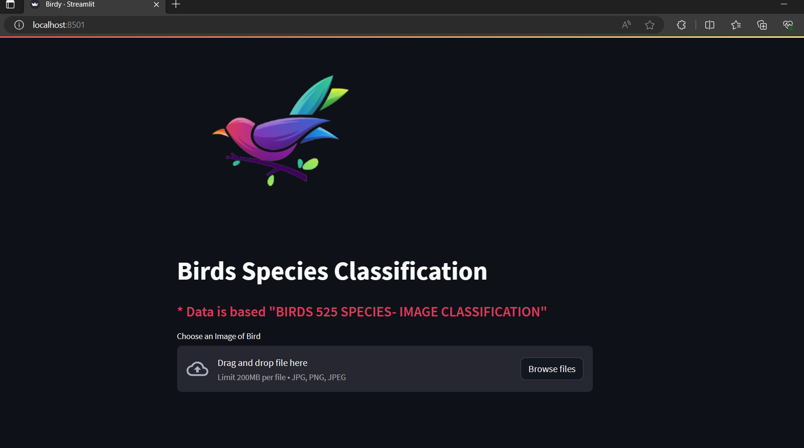
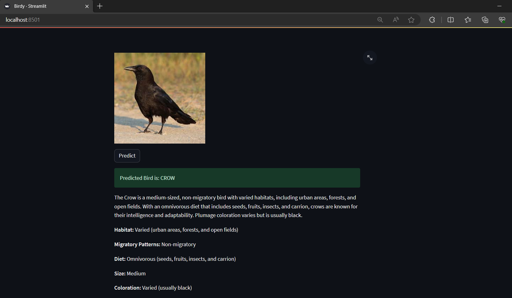

## Birdy
A bird species detecting app with ML Model.

### Working

---

<center><b>Homepage</b></center>

Birdy homepage, where user can upload a bird image and get it's species name and related information. 



---
<center><b>Prediction</b></center>

After uploading a bird image, it will show the species name and bird description.




---

### Installation and Running

For backend.
```sh
cd /Birdy/Birdy_API
pip install flask
python server.py
```

For frontend.
```sh
cd Birdy
pip install -r requirements.txt
streamlit run Birdy.py
```
